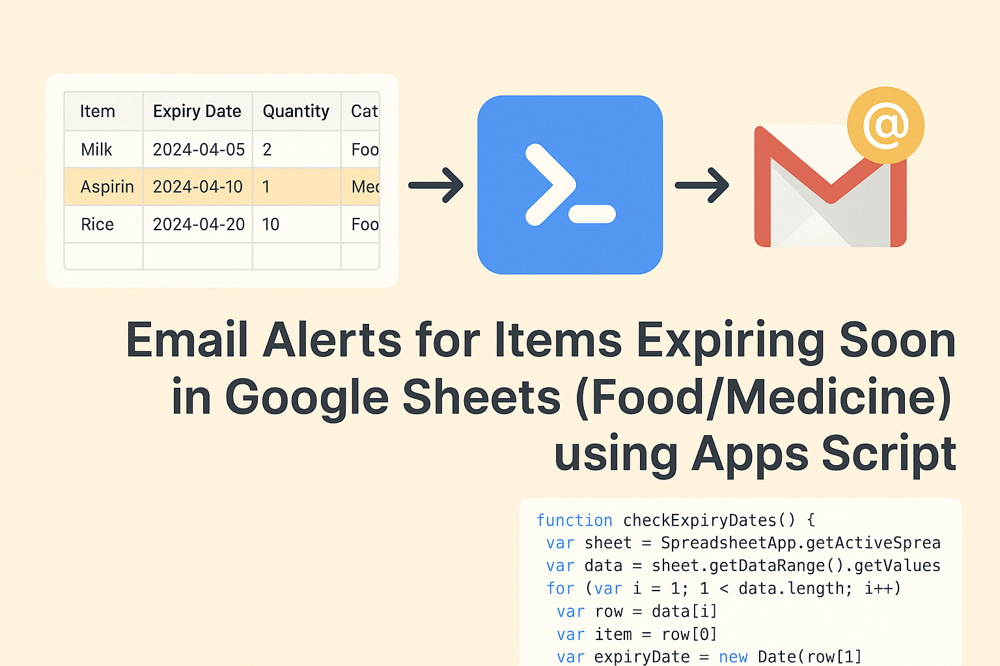

# Google Sheets Expiry Alerts (Apps Script)

<p align="center">
  
</p>
<p align="center">
  <a href="./LICENSE">
    
  </a>
</p>

## Portfolio Relevance

This project supports my healthcare IT and clinical systems direction because it shows a practical automation workflow for medication and inventory safety. It uses a simple Google Sheet as the user interface, Apps Script as the automation layer, and Gmail as the notification channel.

The project demonstrates the same skills needed in health informatics and clinical systems support: understanding workflow risk, reducing manual checking, documenting setup steps, and building reliable reminders around operational data.

## Summary

Email yourself a daily summary of items that are expiring soon from one or more Google Sheets tabs, such as `Food` and `Medicine`. This Apps Script scans specified sheets for `Item Name` and `Expiry Date`, then emails items expiring within a configurable threshold window.

## Features

- Multiple sheet support, defaulting to `Food` and `Medicine`
- Configurable expiry threshold window
- Auto-detection of `Item Name` and `Expiry Date` headers
- Clean daily summary email
- Optional daily time-based trigger helper
- Lightweight, serverless workflow using Google Workspace tools

## Sheet Setup

For each sheet you want to scan, include a header row with at least:

- `Item Name`
- `Expiry Date`

Example:

```text
| Item Name | Expiry Date |
|-----------|-------------|
| Milk      | 2025-12-05  |
| Ibuprofen | 2025-11-22  |
```

## Configuration

Inside `Code.gs` or `Code_Version3.gs`:

- `sheetNames`: array of sheet tabs to scan
- `thresholdDays`: number of days ahead to include
- `recipient`: defaults to the active user email via `Session.getActiveUser().getEmail()`

## Deployment

1. Open your target Google Sheet.
2. Go to Extensions -> Apps Script.
3. Create a new project.
4. Copy the contents of `Code.gs` or `Code_Version3.gs` into the editor and save.
5. Run the function and authorise the script on first use.
6. Optional: create a time-driven trigger for `sendExpiryAlerts`, or run `createDailyTrigger()` once.

## Healthcare IT Skills Demonstrated

- Workflow automation
- Medication and inventory safety thinking
- Google Workspace support
- User-facing documentation
- Scheduled notification design
- Low-code operational improvement

## Notes

- The email is sent only if at least one sheet has items expiring within the threshold window.
- The script ignores rows with invalid or missing dates or item names.
- Dates are read from the sheet; date formatting should be consistent.

## Professional Links

- Case study: https://hanhtetsan.me/tech-support/google-sheets-expiry-alerts-reduce-food-medicine-waste-with-google-apps-script-automation/
- Portfolio: https://hanhtetsan.me/portfolio/
- LinkedIn: https://uk.linkedin.com/in/han-san

## License

Prosperity Public License 3.0.0 - noncommercial use permitted; commercial use requires a separate license from the author. See [LICENSE](./LICENSE.txt) for full terms.
